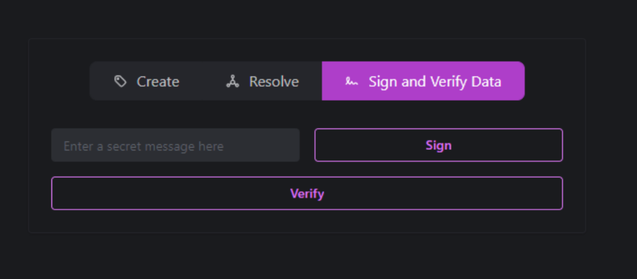
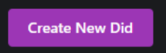
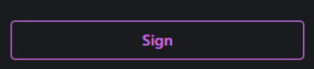
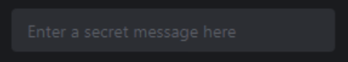
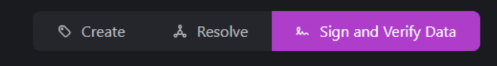
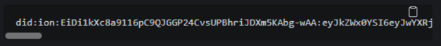

This is a [Next.js](https://nextjs.org/) project bootstrapped with [`create-next-app`](https://github.com/vercel/next.js/tree/canary/packages/create-next-app).

## Getting Started

First, run the development server:

```bash
npm run dev
# or
yarn dev
```

Open [http://localhost:3000](http://localhost:3000) with your browser to see the result.

You can start editing the page by modifying `pages/index.tsx`. The page auto-updates as you edit the file.

[API routes](https://nextjs.org/docs/api-routes/introduction) can be accessed on [http://localhost:3000/api/hello](http://localhost:3000/api/hello). This endpoint can be edited in `pages/api/hello.ts`.

The `pages/api` directory is mapped to `/api/*`. Files in this directory are treated as [API routes](https://nextjs.org/docs/api-routes/introduction) instead of React pages.

This project uses [`next/font`](https://nextjs.org/docs/basic-features/font-optimization) to automatically optimize and load Inter, a custom Google Font.

## Learn More

To learn more about Next.js, take a look at the following resources:

- [Next.js Documentation](https://nextjs.org/docs) - learn about Next.js features and API.
- [Learn Next.js](https://nextjs.org/learn) - an interactive Next.js tutorial.

You can check out [the Next.js GitHub repository](https://github.com/vercel/next.js/) - your feedback and contributions are welcome!

## Deploy on Vercel

The easiest way to deploy your Next.js app is to use the [Vercel Platform](https://vercel.com/new?utm_medium=default-template&filter=next.js&utm_source=create-next-app&utm_campaign=create-next-app-readme) from the creators of Next.js.

Check out our [Next.js deployment documentation](https://nextjs.org/docs/deployment) for more details.


## Frontend Planning

In order to build the UI, I used a design pattern adapted from the ideas discussed in [atomic design](https://bradfrost.com/blog/post/atomic-web-design/). Using these concepts, we're able to break down the mock-up into a hierarchy of react components. The order of components, as it pertains to this project, are as follows:

bit - The smallest possible components used to build up more complex UIs. Agnostic of the logic of the main application for max re-usability
|
containers - Complex components made up of multiple bits or with behavior pertaining to the overall application.
|
views - A fully-fledged UI that can use multiple containers and/or bits. Can contain an entire page.

### Identify Components

In order to plan out how to build the UI, we can start by identifying the core components needed to achieve the screenshots.



#### Button (bit)

There are two kinds of buttons in the mock-ups. One of them has a solid background and the other has a clear background. Using prop in the react component can help us differentiate styles. Further, there are instances of this component with a symbol next to the text. We can leverage [Font Awesome](https://fontawesome.com/start) to pull some relevant free icons. We can also use a prop to show/hide them.

Primary


Secondary


#### input (bit)

This component is very straightforward. We can leverage input HTMLAttributes and avoid planning complex props. This will allow us to focus on the styling.



#### ButtonGroup (container)

We can use the above Button component to combine the buttons into a "group". We can build this component to be more specific to how our application runs. Further, we need to be aware of the parent's need to know when they are clicked. We can use a prop that acts as a clickHandler here.



#### Clipboard (container)

The clipboard is a bit more complex so we'll classify it as a container. This component must do the following

- Display plain text
- Display JSON (to a specific format)
- Multiline or Single line
- Have a styled horizontal scroller
- Be able to capture when the copy button is clicked, and copy the relevant text to the user's clipboard

We can use a single prop for the contents, and the use internal logic to determine if it's json or plaintext. We also need to accept prop a to determine if it'll be single-line or multi-line.


