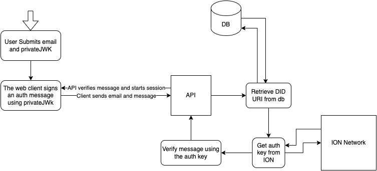

# ION Network Authentication

#### [View a live demo here]()

| Table of Contents                               |
| ----------------------------------------------- |
| I. [Description](#description)                  |
| II. [Usage](#usage)                              |
| III. [Installation](#installation)              |
| IV. [Authentication Flow](#authentication-flow) |
| V. [Acknowledgements](#acknowledgments)         |

## Description

This project aims to demonstrate a possible authentication flow that uses the ION network to identify users. ION is a public, permissionless, Decentralized Identifier (DID) network that implements the blockchain-agnostic Sidetree protocol on top of Bitcoin (as a 'Layer 2' overlay) to support DIDs/DPKI (Decentralized Public Key Infrastructure) at scale. [Read more here](https://identity.foundation/ion/)

## Usage

### Pre-Requisites
This app was built using `Next.js`. It requires that you have `Node.js` installed as well as one of the various node package managers

**System Requirements**:
- Node.js 14.6.0 or newer
- MacOS, Windows (including WSL), and Linux are supported
- Install `npm`, `yarn`, or `pnpm`

### Installation

After cloning the repo, you need to install the dependencies.

using npm:
```bash
$ npm install
```
using yarn:
```bash
$ yarn install
```

### Development
You can run it in dev mode so next automatically updates the DOM using hot reloading. You can do this simply by running one of the following lines.

using npm:
```bash
$ npm run dev
```
using yarn:
```bash
$ yarn dev
```

Visit at `localhost:3000`

##### production
If you want to run a production instance of this webapp locally, you need to build it first. Once it's built, then you can use the start script to run it.

using npm:
```bash
$ npm run build

# Build output here

$ npm run start
```
using yarn:
```bash
$ yarn build

# Build output here

$ yarn start
```

Visit at `localhost:3000`

## Authentication Flow

##### Registration
The way the flow works is it creates a user and stores their DID URI and email. The email is mapped to the DIDUri. We then send them back their privateJWK encoded in `Base64`. We never store the privateJWK.

##### Sign In
When the User wants to log in. They submit their email and token. The token is used to sign a message on the client. This ensures that keys are secured by the user. Reducing possible vulnerabilities in our own systems.

The message is verified by getting the DID URI mapped to the user's email and verifies the auth message. If the verification passes a session is created and the user has successfully been authenticated.



## Reflections

There are a few things in this project that I would do differently if it was production-facing. In no particular order, some of these thoughts include (but are not limited to):

- Adding support for unit tests and adding commit hooks to validate code changes before pushing to the repo.
- Adding e2e tests to verify the entire user flow.
- Leveraging Material UI to implement a website "theme." Especially if designed using a design system.
- Using a DB service to store User data. The type of DB might change depending on scale. The choice to use cookies was to simplify the demo.
- I would hide the client-side implement of ION-tools. This way, we're not exposing our underlying authentication method. I would extend the API and use a different method for creating JSON Web Signatures.
- API access logging and client-side monitoring
- Create more conventions and patterns around commits

## Acknowledgments

This project was built using the [Material UI React library](https://mui.com/). The login/signup pages were built from a [template](https://github.com/mui/material-ui/tree/v5.11.4/docs/data/material/getting-started/templates/sign-in) (also provided by Material).

Shout out to the [Decentralized Identity](https://identity.foundation/) team for providing the [ion-tools](https://github.com/decentralized-identity/ion-tools) lib. This made understanding and usage of the ION network very easily.


